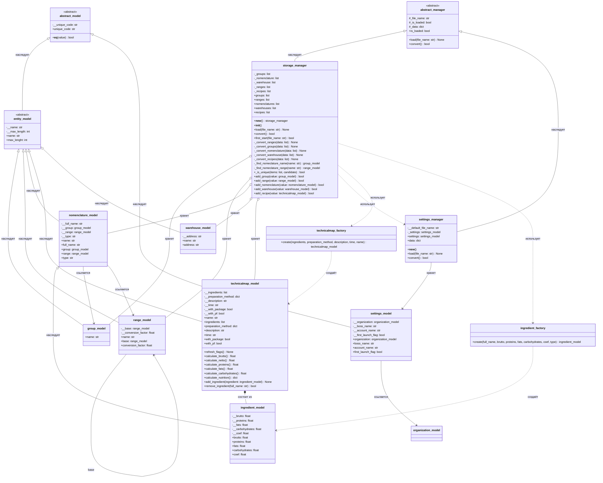

```mermaid
classDiagram
    class abstract_manager {
        <<abstract>>
        #_file_name: str
        #_is_loaded: bool
        #_data: dict
        +load(file_name: str) None
        +convert() bool
        +is_loaded: bool
    }

    class settings_manager {
        -__default_file_name: str
        -_settings: settings_model
        +__new__()
        +load(file_name: str) None
        +convert() bool
        +settings: settings_model
        +data: dict
    }

    class storage_manager {
        -_groups: list
        -_nomenclature: list
        -_warehouse: list
        -_ranges: list
        -_recipes: list
        +__new__() storage_manager
        +__init__()
        +load(file_name: str) None
        +convert() bool
        +first_start(file_name: str) bool
        +groups: list
        +ranges: list
        +nomenclatures: list
        +warehouses: list
        +recipes: list
        -_convert_ranges(data: list) None
        -_convert_groups(data: list) None
        -_convert_nomenclature(data: list) None
        -_convert_warehouse(data: list) None
        -_convert_recipes(data: list) None
        -_find_nomeclature_name(name: str) group_model
        -_find_nomeclature_range(name: str) range_model
        +_is_unique(items: list, candidate) bool
        +add_group(value: group_model) bool
        +add_range(value: range_model) bool
        +add_nomenclature(value: nomenclature_model) bool
        +add_warehouse(value: warehouse_model) bool
        +add_recipe(value: technicalmap_model) bool
    }

    class abstract_model {
        <<abstract>>
        -__unique_code: str
        +unique_code: str
        +__eq__(value) bool
    }

    class entity_model {
        <<abstract>>
        -__name: str
        -__max_length: int
        +name: str
        +max_lenght: int
    }

    class group_model {
        +name: str
    }

    class range_model {
        -__base: range_model
        -__conversion_factor: float
        +name: str
        +base: range_model
        +conversion_factor: float
    }

    class nomenclature_model {
        -__full_name: str
        -__group: group_model
        -__range: range_model
        -__type: str
        +name: str
        +full_name: str
        +group: group_model
        +range: range_model
        +type: str
    }

    class ingredient_model {
        -__brutto: float
        -__proteins: float
        -__fats: float
        -__carbohydrates: float
        -__coef: float
        +brutto: float
        +proteins: float
        +fats: float
        +carbohydrates: float
        +coef: float
    }

    class technicalmap_model {
        -__ingredients: list
        -__preparation_method: dict
        -__description: str
        -__time: str
        -__with_package: bool
        -__with_pf: bool
        +name: str
        +ingredients: list
        +preparation_method: dict
        +description: str
        +time: str
        +with_package: bool
        +with_pf: bool
        +refresh_flags() None
        +calculate_brutto() float
        +calculate_netto() float
        +calculate_proteins() float
        +calculate_fats() float
        +calculate_carbohydrates() float
        +calculate_nutrition() dict
        +add_ingredient(ingredient: ingredient_model) None
        +remove_ingredient(full_name: str) bool
    }

    class warehouse_model {
        -__address: str
        +name: str
        +address: str
    }

    class settings_model {
        -__organization: organization_model
        -__boss_name: str
        -__account_name: str
        -__first_launch_flag: bool
        +organization: organization_model
        +boss_name: str
        +account_name: str
        +first_launch_flag: bool
    }

    class technicalmap_factory {
        +create(ingredients, preparation_method, description, time, name) technicalmap_model
    }

    class ingredient_factory {
        +create(full_name, brutto, proteins, fats, carbohydrates, coef, type) ingredient_model
    }

    %% Наследование (полая треугольная стрелка) — "является"
    abstract_manager <|-- storage_manager : наследует
    abstract_manager <|-- settings_manager : наследует

    abstract_model <|-- entity_model : наследует
    entity_model <|-- group_model : наследует
    entity_model <|-- range_model : наследует
    entity_model <|-- nomenclature_model : наследует
    entity_model <|-- technicalmap_model : наследует
    entity_model <|-- warehouse_model : наследует
    abstract_model <|-- settings_model : наследует
    nomenclature_model <|-- ingredient_model : наследует

    %% Композиция (чёрный ромб) — "владеет"
    technicalmap_model *-- ingredient_model : состоит из

    %% Агрегация (полый ромб) — "содержит"
    storage_manager o-- group_model : хранит
    storage_manager o-- range_model : хранит
    storage_manager o-- nomenclature_model : хранит
    storage_manager o-- warehouse_model : хранит
    storage_manager o-- technicalmap_model : хранит

    %% Ассоциация (простая стрелка) — "ссылается"
    nomenclature_model --> group_model : ссылается
    nomenclature_model --> range_model : ссылается
    range_model --> range_model : base
    settings_manager --> settings_model : хранит
    settings_model --> organization_model : ссылается

    %% Зависимость (пунктир) — "использует"
    storage_manager ..> settings_manager : использует
    storage_manager ..> technicalmap_factory : использует
    storage_manager ..> ingredient_factory : использует
    technicalmap_factory ..> technicalmap_model : создаёт
    ingredient_factory ..> ingredient_model : создаёт
```
