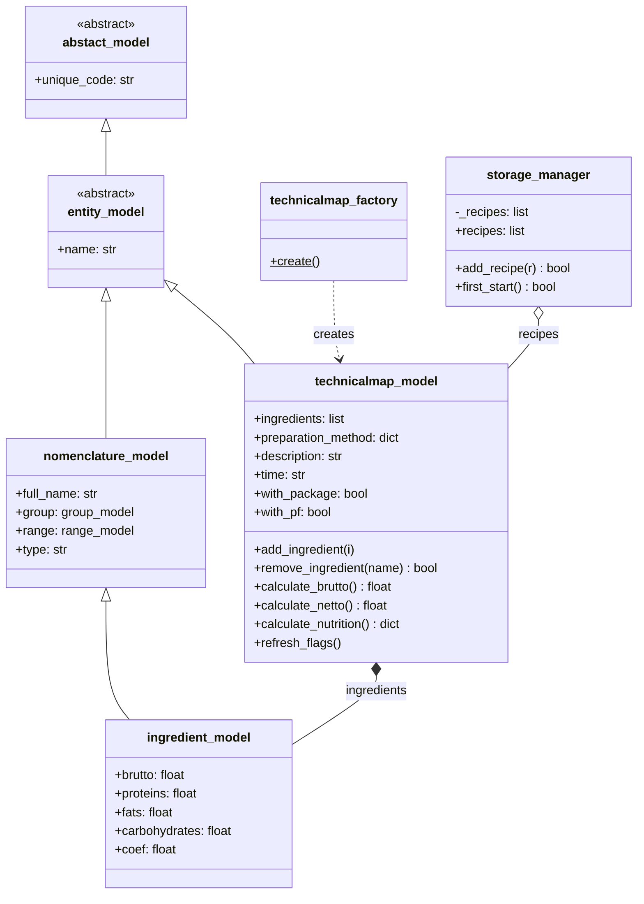

```mermaid
classDiagram
    class abstact_model {
        <<abstract>>
        +unique_code: str
    }
    class entity_model {
        <<abstract>>
        +name: str
    }
    class nomenclature_model {
        +full_name: str
        +group: group_model
        +range: range_model
        +type: str
    }
    class ingredient_model {
        +brutto: float
        +proteins: float
        +fats: float
        +carbohydrates: float
        +coef: float
    }
    class technicalmap_model {
        +ingredients: list
        +preparation_method: dict
        +description: str
        +time: str
        +with_package: bool
        +with_pf: bool
        +add_ingredient(i)
        +remove_ingredient(name) bool
        +calculate_brutto() float
        +calculate_netto() float
        +calculate_nutrition() dict
        +refresh_flags()
    }
    class technicalmap_factory {
        +create()$
    }
    class storage_manager {
        -_recipes: list
        +recipes: list
        +add_recipe(r) bool
        +first_start() bool
    }

    abstact_model <|-- entity_model
    entity_model <|-- nomenclature_model
    nomenclature_model <|-- ingredient_model
    entity_model <|-- technicalmap_model
    technicalmap_model  *--  ingredient_model : ingredients
    technicalmap_factory ..> technicalmap_model : creates
    storage_manager  o-- technicalmap_model : recipes
```
