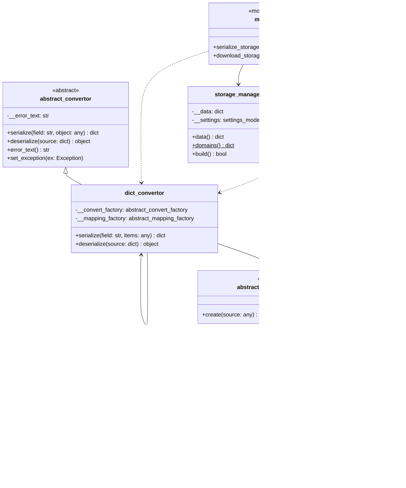

```mermaid
classDiagram
    class abstract_convertor {
        <<abstract>>
        -__error_text: str
        +serialize(field: str, object: any) dict
        +deserialize(source: dict) object
        +error_text() str
        +set_exception(ex: Exception)
    }

    class abstract_convert_factory {
        <<abstract>>
        +create(source: any) abstract_convertor
    }

    class abstract_mapping_factory {
        <<abstract>>
        +to_dto(source: object) object
        +to_model(source: object) object
    }
    class dict_convertor {
        -__convert_factory: abstract_convert_factory
        -__mapping_factory: abstract_mapping_factory
        +serialize(field: str, items: any) dict
        +deserialize(source: dict) object
    }

    class convert_factory {
        -__mapping: Dict~Type, Type[abstract_convertor]~
        -__mapping_factory: mapping_factory
        +create(source: Any) abstract_convertor
    }

    class mapping_factory {
        -__mapping: Dict~Type, Type~
        +to_dto(source: object) object
        +to_model(source: object) object
    }
    class main {
        <<module>>
        +serialize_storage() dict
        +download_storage() Response
    }

    class convertor {
        -__factory: convert_factory
        +serialize(source: any) dict
    }

    class storage_manager {
        -__data: dict
        -__settings: settings_model
        +data() dict
        +domains()$ dict
        +build() bool
    }

    abstract_convertor <|-- dict_convertor
    abstract_convert_factory <|-- convert_factory
    abstract_mapping_factory <|-- mapping_factory

    dict_convertor --> abstract_convert_factory
    dict_convertor --> abstract_mapping_factory

    convert_factory --> dict_convertor
    convert_factory --> mapping_factory

    convertor --> convert_factory
    convertor ..> dict_convertor

    main --> convertor
    main --> storage_manager
    main ..> dict_convertor
```
