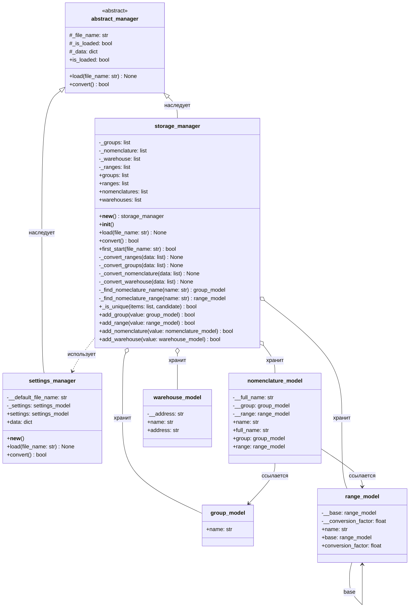

```mermaid
classDiagram
    class abstract_manager {
        <<abstract>>
        #_file_name: str
        #_is_loaded: bool
        #_data: dict
        +load(file_name: str) None
        +convert() bool
        +is_loaded: bool
    }

    class settings_manager {
        -__default_file_name: str
        -_settings: settings_model
        +__new__()
        +load(file_name: str) None
        +convert() bool
        +settings: settings_model
        +data: dict
    }

    class storage_manager {
        -_groups: list
        -_nomenclature: list
        -_warehouse: list
        -_ranges: list
        +__new__() storage_manager
        +__init__()
        +load(file_name: str) None
        +convert() bool
        +first_start(file_name: str) bool
        +groups: list
        +ranges: list
        +nomenclatures: list
        +warehouses: list
        -_convert_ranges(data: list) None
        -_convert_groups(data: list) None
        -_convert_nomenclature(data: list) None
        -_convert_warehouse(data: list) None
        -_find_nomeclature_name(name: str) group_model
        -_find_nomeclature_range(name: str) range_model
        +_is_unique(items: list, candidate) bool
        +add_group(value: group_model) bool
        +add_range(value: range_model) bool
        +add_nomenclature(value: nomenclature_model) bool
        +add_warehouse(value: warehouse_model) bool
    }

    class group_model {
        +name: str
    }

    class range_model {
        -__base: range_model
        -__conversion_factor: float
        +name: str
        +base: range_model
        +conversion_factor: float
    }

    class nomenclature_model {
        -__full_name: str
        -__group: group_model
        -__range: range_model
        +name: str
        +full_name: str
        +group: group_model
        +range: range_model
    }

    class warehouse_model {
        -__address: str
        +name: str
        +address: str
    }

    %% Наследование (полая треугольная стрелка) — "является"
    abstract_manager <|-- storage_manager : наследует
    abstract_manager <|-- settings_manager : наследует

    %% Агрегация (полый ромб) — "содержит"
    storage_manager  o--  group_model : хранит
    storage_manager  o--  range_model : хранит
    storage_manager  o--  nomenclature_model : хранит
    storage_manager  o--  warehouse_model : хранит

    %% Ассоциация (простая стрелка) — "ссылается"
    nomenclature_model  -->  group_model : ссылается
    nomenclature_model  -->  range_model : ссылается
    range_model  -->  range_model : base

    %% Зависимость (пунктир) — "использует"
    storage_manager ..> settings_manager : использует
```
